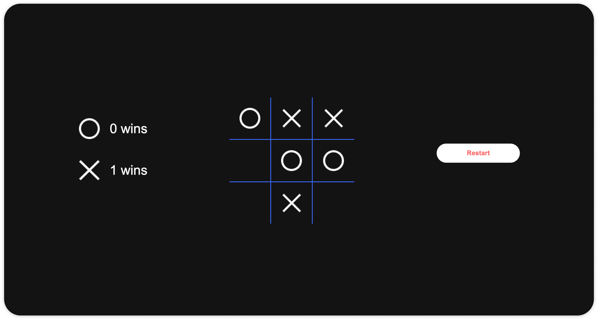
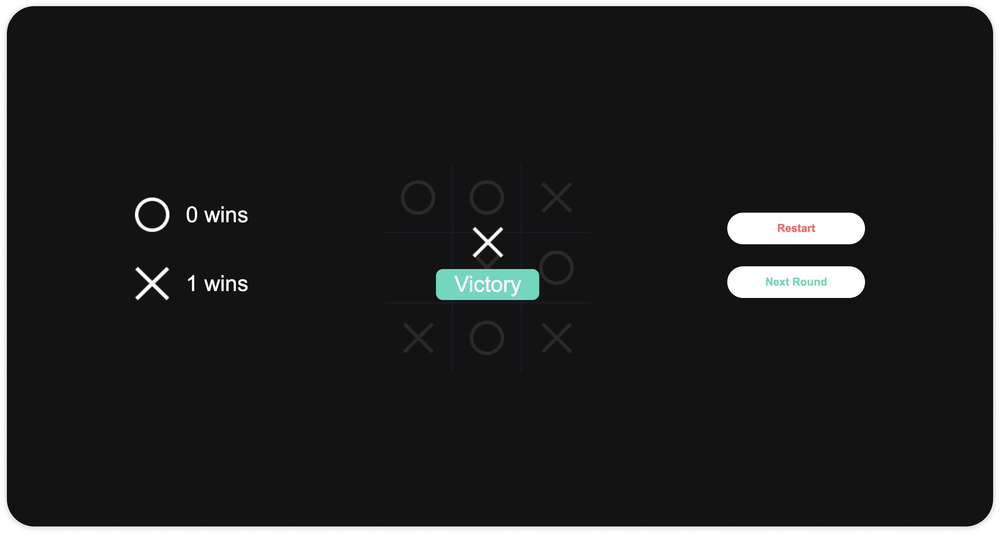

# About

This project is a study about ReactJs.

A simple Tic Tac Toe game, for local playing. It works by rounds, where each player, X and O, plays one after the other.

You can also Reset the game score, and go ahead to next round.

## Is it open to contributions?

Yes, feel free to contribute to this project as you want, I'll be glad to analyse your PRs.

## Screenshots

